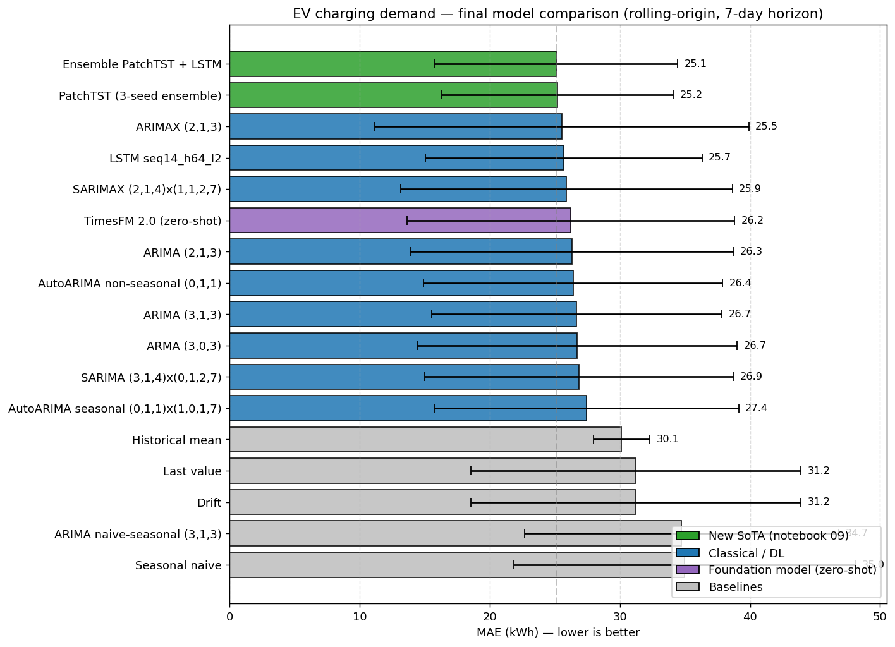

# Short-Term EV Charging Demand Forecasting — Boulder, Colorado

Daily energy demand forecasting at public EV charging stations, using the **Electric Vehicle Charging Station Data** dataset published by the City of Boulder, Colorado on its [Open Data portal](https://open-data.bouldercolorado.gov/datasets/95992b3938be4622b07f0b05eba95d4c_0/about).

**Authors:** Alexander Jauregui Orue, Eneko Alvarez Mendia, Erik Eguskiza Aranda

## Overview

The dataset contains ~148K charging session records from 26 city-owned stations between January 2018 and November 2023. Sessions are aggregated to **daily frequency** for the highest-volume station, producing a univariate series of ~2,000 observations with strong weekly and annual seasonality. The forecasting horizon is **7 days ahead**, evaluated with rolling-origin (4 windows) on a held-out test set. Exogenous variables (temperature, day of week, holiday indicator) are used in the SARIMAX / ARIMAX variants. A zero-shot foundation-model benchmark (Google **TimesFM**, Amazon **Chronos**) is added as an extension to compare pre-trained models against classical and deep-learning approaches.

## Repository Structure

```
ev-charging-forecasting/
├── data/                  # Dataset + cached artifacts (LSTM weights, SARIMA grid)
├── docs/                  # Figures used in the README
├── notebooks/             # Jupyter notebooks (main deliverable)
├── scripts/               # Reusable utilities (metrics, evaluation, training)
├── requirements.txt
└── README.md
```

| Notebook | Description |
|----------|-------------|
| `00_eda.ipynb` | Exploratory analysis: session distribution, station volumes, seasonality (STL) |
| `01_preprocessing.ipynb` | Daily aggregation, exogenous variable integration (Open-Meteo), train/test split |
| `02_stationarity.ipynb` | ADF test, differencing, ACF/PACF, random-walk rejection |
| `03_baselines.ipynb` | Naive forecasts: historical mean, last value, seasonal naive, drift |
| `04_sarima.ipynb` | SARIMA / SARIMAX: AIC grid search, Ljung-Box diagnostics, rolling forecast |
| `05_lstm.ipynb` | LSTM: sequence preparation, hyper-parameter sweep, training, evaluation |
| `06_google_vs_amazon.ipynb` | Zero-shot foundation models: Google TimesFM 1.0/2.0 vs Amazon Chronos-T5 base/large |
| `07_ensemble.ipynb` | Ensemble of SARIMAX + LSTM + TimesFM with prediction intervals and empirical coverage |
| `08_arma_arima_autoarima.ipynb` | ARMA, ARIMA, ARIMAX, AutoARIMA (seasonal + non-seasonal) and unified leaderboard |
| `09_sota_patchtst_stacking.ipynb` | **PatchTST** (ICLR 2023) trained from scratch + DL ensemble — best model in the project's local leaderboard |

## Results

All models share the same protocol: rolling-origin, 7-day horizon, 4 test windows on the last 30 days. Best in the leaderboard is the **PatchTST + LSTM mean ensemble** with **MAE 25.09 kWh**.



**Highlights:**
- **PatchTST + LSTM mean ensemble** (notebook 09) is the best model overall, beating every classical / foundation / single-DL model with the same protocol.
- **PatchTST alone** (3-seed ensemble) is the best *single* architecture (~35% lower std than ARIMAX).
- **Google vs Amazon (zero-shot)**: TimesFM beats Chronos on this series — the larger Chronos-T5 (710M) is actually the worst foundation model. More parameters ≠ better.
- Naive baselines are beaten by ~28% in MAE.

Full table (every model, every metric, source notebook) → [`docs/RESULTS.md`](docs/RESULTS.md)

## Dataset

Download the CSV from the [Boulder Open Data portal](https://open-data.bouldercolorado.gov/datasets/95992b3938be4622b07f0b05eba95d4c_0/about) and place it in the `data/` directory.

## Setup

```bash
python3 -m venv .venv
source .venv/bin/activate
pip install -r requirements.txt
```

## Tech Stack

- Python 3.11, pandas, statsmodels (SARIMAX), pmdarima (AutoARIMA), scikit-learn, scipy
- PyTorch (LSTM, PatchTST), matplotlib
- Foundation models: Google **TimesFM** 1.0 + 2.0, Amazon **Chronos**-T5 base + large
- Weather data via Open-Meteo API

Heavy training is kept out of the notebooks — model artifacts are produced by the standalone scripts and loaded back from `data/`:

```bash
python scripts/sarima_grid_search.py     # AIC grid → data/sarima_grid_results.csv
python scripts/lstm_train.py             # LSTM sweep + best model → data/lstm/
python scripts/patchtst_train.py         # PatchTST 3-seed ensemble → data/patchtst/
```
